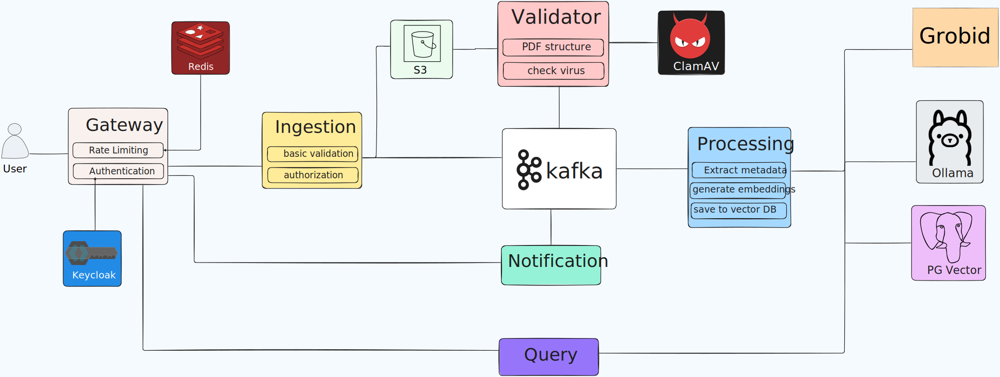

  
   
   
  <a href="https://www.flaticon.com/free-icons/mid-autumn-festival" title="mid autumn festival icons">Art from flaticon by Freepik</a>

# Theia

> ⚠️ Project Status: This project is currently under active development. Features and APIs may change.

Theia is a distributed solution for finding similarities between academic white papers and research documents. It leverages vector databases and machine learning embeddings to enable researches and organizations to discover related content across large documents collections. The system also includes a frontend interface for users to upload and search documents.

# Overview

Theia processes PDF documents asynchronously, extracts structured metadata, generates vector embeddings, and provides semantic search capabilities to find similar research papers.

# Features

- **API Gateway** to handle authentication through Keycloak and rate limiting using Redis.
- **Event-Driven** Architecture using Kafka.
- **Metadata extraction** from academic papers.
- **Embedding generation** with `nomic-embed-text` model.
- **Vector Storage** for similarity searches using cosine distance.
- **Security** with file validation and virus scanning using ClamAV.

# Tech

- Spring boot
- Spring Cloud Gateway
- Apache Kafka
- PG Vector
- Ollama
- Grobid
- AWS S3
- ClamAV
- Keycloack
- Redis
- ReactJS
